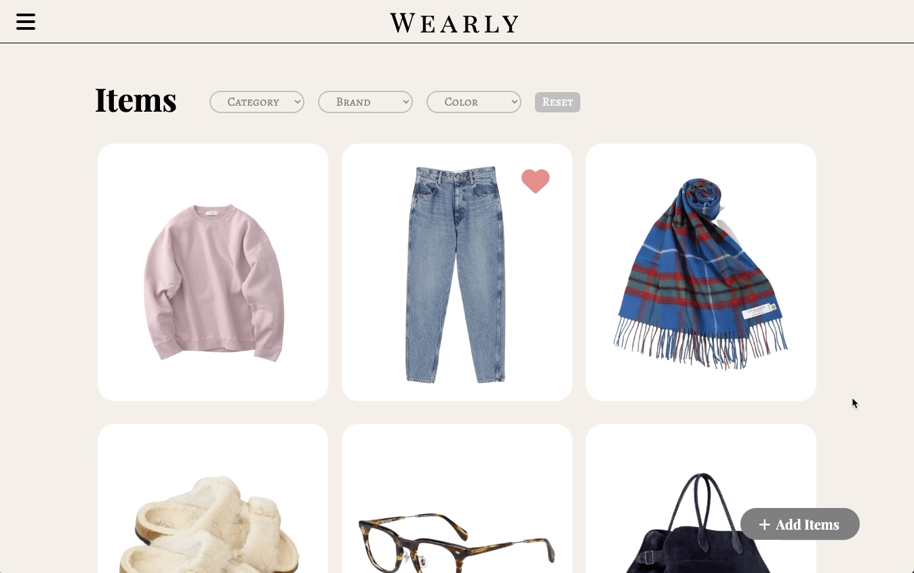

# 👗Wearly
A full-stack web application for people who want to organize fashion items and save outfits digitally.

## Why I Built This

Since sometimes I waste my time by taking out all my clothes to decide what I'm going to wear on the day and putting them back in my closet in the morning, I wanted to build an application where I could see fashion items I have from my device and also record my favorite outfits.

## Link Demo
Try the application live at https://wearly.mioriimai.com/

## Technologies Used
- React.js
- Node.js
- PostgreSQL
- AWS S3
- Webpack
- Babel
- HTML5
- CSS3
- Dokku
- Figma
- DBDesigner

## Features
- Users can add an item.
- Users can view a list of items.
- Users can edit an item.
- Users can delete an item.
- Users can sort items.
- Users can add an item to their favorites.
- Users can create an outfit.
- Users can view a list of outfits.
- Users can edit an outfit.
- Users can delete an outfit.
- Users can add an outfit to their favorite.
- Users can sign up.
- Users can sign in.
- Users can sigh out.
- Users can sign in to the demo account.

## Preview
Users can sort items.

Users can create an outfit.

## Stretch features
- Users can remove the background of an image.
- Users can adjust the size of items when they create an outfit.
- Users can edit their brand list.

## Development
### System Requirements
- React
- Express
- Node.js 10 or higher
- NPM 6 or higher
- PostgreSQL
- MulterS3

### Getting Started
1. Clone the repository.
2. Install all dependencies using npm.
3. Set up an account with AWS S3 and establish a bucket to store images uploaded by users.
4. Make a copy of the .env file and add the necessary environment variables, including a token secret, database URL, and AWS bucket information.
6. Start PostgreSQL sudo service
5. Run db:import to establish database.
7. Run dev to start server.
8. Open in browser at localhost:3000.
